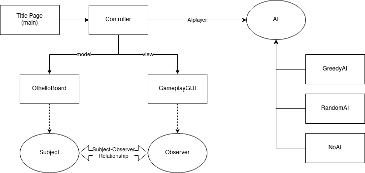

# Othello_Game

## Table of Contents
  <ol>
    <li>
      <a href="#about-the-project">About The Project</a>
    </li>
    <li>
      <a href="#getting-started">Getting Started</a>
      <ul>
        <li><a href="#installing-dependencies">Installing Dependencies</a></li>
      </ul>
    </li>
    <li><a href="#build">Build</a></li>
    <li>
      <a href="#usage">Usage</a></li>
      <ul>
        <li><a href="#using-gui-version">Using gui version</a></li>
        <li><a href="#using-cli-version">Using cli version</a></li>
      </ul>
    <li><a href="#license">License</a></li>
  </ol>

 
<!-- ABOUT THE PROJECT -->
## About the project
A project with both single and double player based Othello game

## Design Patterns


The design patterns used in the project were
 - MVC (Model - View Controller) design pattern
 - Strategy
 - Null Object

## Getting started
Before playing the game some dependies are needed which are listed below.

### Installing Dependencies
- g++-10
```sh
sudo apt-get update
sudo apt install g++-10
```
- fmt library
```sh
sudo apt update
sudo apt install libfmt-dev
```
- SFML library
```sh
sudo apt update
sudo apt-get install libsfml-dev
```

- TGUI library
```sh
sudo add-apt-repository ppa:texus/tgui
sudo apt-get update
sudo apt-get install libtgui-0.9-dev
```

## Build
```sh
git clone https://github.com/IITH-CS1023/cs1023-sdf-project-team-15.git Othello_Game
cd Othello_Game

#to build the executable for gui version
make all
#to run the executable for gui version
make run

#to build the executable for cli version
make all_cli
#to run the executable for cli version
make run_cli
```
## Usage
How to play the game and some rules

### Using gui version

- First select the mode of play
- Press the mouse where you want to place your coin
- Press "pass" if you dont want to play your turn (Remember if both players press pass at the same turn then the game will be over there).

### Using cli version

- Enter the coordinate of the block where you want to place your coin
- The game will end if the board is totally filled
- If you want to exit the game press "Crtl+C"


## License
Distributed under the GNU GPL v3.0 License. See [LICENSE](LICENSE) for more information.

<!-- [](https://classroom.github.com/online_ide?assignment_repo_id=402094&assignment_repo_type=GroupAssignmentRepo)
 -->
